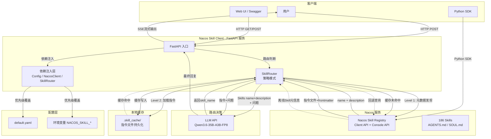

# Nacos Skill Registry Python Client

通过 Nacos 3.x Client API 管理 AI Skills 的 Python 客户端库 + FastAPI 服务。

## 系统架构



## 三层加载机制（借鉴 Anthropic Skills 设计）

| 层级 | 功能 | Token 消耗 |
|------|------|-----------|
| **Level 1: Discovery** | 启动时解析所有 Skill 的 frontmatter（name + description），注入 system prompt | ~100 tokens/Skill |
| **Level 2: Activation** | LLM 匹配后才加载完整 SKILL.md 指令 | ~5k tokens/Skill |
| **Level 3: Execution** | LLM 从指令中自行发现脚本/工具并执行 | 取决于脚本输出 |

### 工作流程

```
用户提问
  ↓
Level 1: LLM 从 name+description 列表中选出最匹配的 Skill
  ↓
Level 2: 从本地缓存读取指令文件（命中→秒级）或从 Nacos 下载（未命中→下载+缓存）
  ↓
Level 3: LLM 按指令执行，可能生成或调用脚本
```

## 核心功能

| 功能 | 说明 |
|------|------|
| 📦 **配置管理** | Pydantic-settings + YAML，环境变量优先（`NACOS_SKILL_*` 前缀） |
| 🏗️ **Pydantic v2 模型** | 更强的类型验证和序列化 |
| 🤖 **Skill 自动路由** | 策略模式 + 工厂模式，LLM 路由 + 关键词路由 |
| 📡 **三层加载** | 借鉴 Anthropic Skills 的 Discovery → Activation → Execution |
| 💾 **本地缓存** | 指令文件自动缓存到 `.skill_cache/`，避免重复下载 |
| 🌐 **FastAPI REST API** | Skills 管理 + 路由 + SSE 流式 |
| 🧪 **测试套件** | 75 个测试用例覆盖配置、模型、路由、缓存、工具 |
| 🐳 **Docker 化** | Dockerfile + docker-compose 一键部署 |

## 安装

```bash
pip install -e ".[dev]"
```

## 快速开始 — 作为库使用

```python
from nacos_skill_client import NacosSkillClient

client = NacosSkillClient()

# Level 1: 元数据发现（轻量级，仅 name + description）
metadata_list = client.scan_skills_metadata()
for meta in metadata_list:
    print(f"{meta.name}: {meta.description}")

# Level 2: 按需加载完整指令
content = client.load_skill_metadata("翻译助手")
print(content.instructions)

# 搜索 Skills
result = client.search_skills(keyword="翻译", page_size=10)
for skill in result.page_items:
    print(f"{skill.name}: {skill.description}")

# 获取所有 Skills
all_skills = client.get_all_skills()

# 获取 SKILL.md
detail = client.get_skill_detail("翻译助手")
skill_md = client.get_skill_md("翻译助手", detail.editing_version)

client.close()
```

### 使用本地缓存

```python
from nacos_skill_client import NacosSkillClient, SkillCache
from nacos_skill_client.config import Config

config = Config.load()
cache = SkillCache(cache_dir=".skill_cache")
client = NacosSkillClient(config=config, cache=cache)

# 首次请求：从 Nacos 下载并缓存
content = client.get_skill_md("翻译助手")

# 再次请求：直接从本地读取
cached_content, _ = cache.get_skill_file("翻译助手", "AGENTS.md")
```

### 使用 Config 注入

```python
from nacos_skill_client import NacosSkillClient
from nacos_skill_client.config import Config

config = Config.load()  # 从 YAML + 环境变量加载
client = NacosSkillClient(config=config)
```

## 环境变量配置

```bash
# Nacos
export NACOS_SKILL_NACOS__SERVER_ADDR=http://192.168.1.118:8848
export NACOS_SKILL_NACOS__USERNAME=nacos
export NACOS_SKILL_NACOS__PASSWORD=nacos

# LLM
export NACOS_SKILL_LLM__BASE_URL=http://192.168.1.118:8000/v1
export NACOS_SKILL_LLM__MODEL=Qwen3.6-35B-A3B-FP8

# API 服务
export NACOS_SKILL_API__HOST=0.0.0.0
export NACOS_SKILL_API__PORT=8899

# 本地缓存
export NACOS_SKILL_CACHE__ENABLED=true
export NACOS_SKILL_CACHE__DIR=.skill_cache
export NACOS_SKILL_CACHE__TTL_DAYS=7
```

详细配置见 `config/default.yaml`。

## Skill 自动路由

```python
from nacos_skill_client import NacosSkillClient
from nacos_skill_client.config import Config
from nacos_skill_client.router import SkillRouter
from nacos_skill_client.utils import create_llm_client

# 初始化
config = Config.load()
client = NacosSkillClient(config=config)
llm = create_llm_client(config.llm.base_url, config.llm.api_key)

# 创建路由器（LLM 路由 + 负面/正面示例）
router = SkillRouter.create_llm(llm)

# 执行路由
skills = client.get_all_skills()
result = router.route(skills, "帮我翻译这段文本：Hello World")
print(result.skill_name, result.reason)
```

### 路由 Prompt 改进

借鉴 skills-agent-proto 的设计，路由 Prompt 包含：
- 严格 JSON 输出格式要求（不要 Markdown 代码块）
- 正面示例：代码、安全审计、文档搜索、日历、任务、浏览器、多维表格
- 负面示例：通用翻译、寒暄、知识问答、数学计算等返回 null 的场景

## FastAPI 服务

```bash
# 启动服务
python -m api.main

# 或使用 uvicorn
uvicorn api.main:app --host 0.0.0.0 --port 8899
```

### API 端点

| 方法 | 路径 | 说明 |
|------|------|------|
| GET | `/health` | 健康检查 |
| GET | `/api/v1/skills/metadata` | **Level 1 元数据发现**（name + description） |
| GET | `/api/v1/skills/search` | 搜索 Skills |
| GET | `/api/v1/skills` | 列出 Skills |
| GET | `/api/v1/skills/all` | 获取所有 Skills |
| GET | `/api/v1/skills/{name}` | 获取 Skill 详情 |
| GET | `/api/v1/skills/{name}/versions/{version}` | 获取版本详情 |
| GET | `/api/v1/skills/{name}/md/{version}` | 获取 SKILL.md |
| GET | `/api/v1/skills/{name}/agents/{version}` | 获取 AGENTS.md |
| POST | `/api/v1/skills/route` | Skill 路由 + 执行 |
| POST | `/api/v1/skills/route/stream` | 路由 + 流式执行 (SSE) |

### 路由请求示例

```bash
curl -X POST http://localhost:8899/api/v1/skills/route \
  -H "Content-Type: application/json" \
  -d '{"query": "帮我翻译一段文本", "keyword": "翻译", "strategy": "llm"}'
```

### 元数据发现示例

```bash
curl http://localhost:8899/api/v1/skills/metadata
```

返回所有 Skill 的元数据（Level 1），仅含 name + description：

```json
{
  "total_count": 186,
  "skills": [
    {"name": "ZK 管家", "description": "资产管理..."},
    {"name": "翻译助手", "description": "文本翻译..."},
    ...
  ]
}
```

## 本地缓存

技能指令文件自动缓存在 `.skill_cache/` 目录：

```
.skill_cache/
├── ZK 管家/
│   ├── AGENTS.md
│   ├── SOUL.md
│   └── manifest.json  (name, version, download_time)
├── 翻译助手/
│   ├── AGENTS.md
│   └── manifest.json
└── ...
```

### 缓存配置

```yaml
cache:
  enabled: true        # 是否启用缓存
  dir: ".skill_cache"  # 缓存目录
  ttl_days: 7          # 缓存有效期（天）
```

### 缓存命中流程

```
路由选中 "翻译助手"
  ↓
检查 .skill_cache/翻译助手/AGENTS.md → 存在？
  ├─ 是 → 直接使用，毫秒级响应
  └─ 否 → 从 Nacos 下载 → 写入缓存 → 使用
```

## Docker 部署

```bash
# 构建并启动
docker-compose up -d

# 查看日志
docker-compose logs -f nacos-skill-api

# 停止
docker-compose down
```

## 测试

```bash
pip install -e ".[dev]"
pytest tests/ -v
# 75 个测试用例全部通过
```

## 目录结构

```
nacos-skill-client/
├── nacos_skill_client/
│   ├── __init__.py          # 公共 API 导出
│   ├── cache.py             # 本地 Skill 缓存（SkillCache）
│   ├── client.py            # 主客户端类（含三层加载）
│   ├── models.py            # Pydantic v2 数据模型 + SkillMetadata/SkillContent
│   ├── exceptions.py        # 异常定义
│   ├── config.py            # 配置管理（Pydantic-settings + YAML）
│   ├── router.py            # Skill 路由（策略 + 工厂模式 + 改进 Prompt）
│   └── utils.py             # LLM 调用封装
├── api/
│   ├── __init__.py
│   ├── main.py              # FastAPI 入口
│   ├── routes.py            # 路由定义 + SSE 流式（含缓存集成）
│   ├── schemas.py           # Pydantic 请求/响应模型
│   └── dependencies.py      # 依赖注入（含 SkillCache 集成）
├── tests/
│   ├── __init__.py
│   ├── conftest.py          # 共享 fixtures
│   ├── test_cache.py        # 缓存测试（24 个用例）
│   ├── test_config.py       # 配置测试
│   ├── test_extract_body.py # frontmatter 提取测试
│   ├── test_models.py       # 模型测试
│   ├── test_router.py       # 路由测试（含 prompt 测试）
│   └── test_utils.py        # 工具测试
├── config/
│   └── default.yaml         # 默认配置
├── examples/
│   ├── auto_skill_router.py # 原始路由示例
│   └── usage_example.py     # 基础使用示例
├── Dockerfile
├── docker-compose.yml
├── pyproject.toml
└── README.md
```

## 数据模型

### SkillMetadata（Level 1 — 轻量级发现）
- `name`: Skill 唯一名称
- `description`: 何时使用此 Skill 的描述
- `skill_path`: Skill 文件路径
- `to_prompt_line()`: 生成 system prompt 中的单行描述

### SkillContent（Level 2 — 按需加载）
- `metadata`: SkillMetadata 实例
- `instructions`: SKILL.md body 内容（不含 frontmatter）

### RouteResult
- `skill_name`: 推荐的 Skill 名称，null 表示不需要任何 Skill
- `reason`: 推荐理由

## 借鉴设计

本项目借鉴了以下项目的优秀实践：

| 项目 | 借鉴内容 |
|------|---------|
| [Anthropic Claude Skills](https://docs.anthropic.com/en/docs/agents-and-tools/claude-code/skills) | 三层加载机制（Discovery → Activation → Execution） |
| [skills-agent-proto](https://github.com/NanmiCoder/skills-agent-proto) | SkillMetadata/SkillContent 数据模型、load_skill tool、frontmatter 解析 |
| [Nacos Skill Registry](https://nacos.io/docs/latest/manual/user/open-api/) | AgentSpec API、Skill 下载 API、四级回退策略 |

## 许可证

MIT
