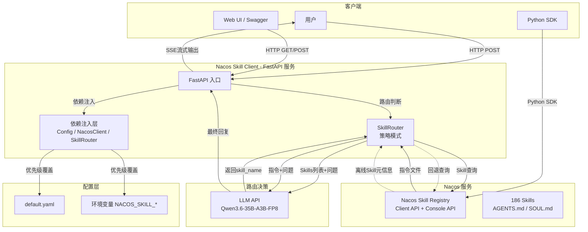

# Nacos Skill Registry Python Client

通过 Nacos 3.x Client API 管理 AI Skills 的 Python 客户端库 + FastAPI 服务。

## 系统架构



## 新增功能 (v0.2)

- 📦 **配置管理** — Pydantic-settings + YAML，环境变量优先（`NACOS_SKILL_*` 前缀）
- 🏗️ **Pydantic v2 模型** — 更强的类型验证和序列化
- 🤖 **Skill 自动路由** — 策略模式 + 工厂模式，支持 LLM 和关键词路由
- 🌐 **FastAPI REST API** — Skills CRUD + 路由 + SSE 流式
- 🧪 **测试套件** — pytest 测试覆盖配置、模型、路由、工具
- 🐳 **Docker 化** — Dockerfile + docker-compose 一键部署

## 安装

```bash
pip install -e ".[dev]"
```

## 快速开始 — 作为库使用

```python
from nacos_skill_client import NacosSkillClient

client = NacosSkillClient()

# 搜索 Skills
result = client.search_skills(keyword="翻译", page_size=10)
for skill in result.page_items:
    print(f"{skill.name}: {skill.description}")

# 获取所有 Skills
all_skills = client.get_all_skills()

# 获取 SKILL.md
detail = client.get_skill_detail("翻译助手")
skill_md = client.get_skill_md("翻译助手", detail.editing_version)

client.close()
```

### 使用 Config 注入

```python
from nacos_skill_client import NacosSkillClient
from nacos_skill_client.config import Config

config = Config.load()  # 从 YAML + 环境变量加载
client = NacosSkillClient(config=config)
```

## 环境变量配置

```bash
# Nacos
export NACOS_SKILL_NACOS__SERVER_ADDR=http://192.168.1.118:8002
export NACOS_SKILL_NACOS__USERNAME=nacos
export NACOS_SKILL_NACOS__PASSWORD=nacos

# LLM
export NACOS_SKILL_LLM__BASE_URL=http://192.168.1.118:8000/v1
export NACOS_SKILL_LLM__MODEL=Qwen3.6-35B-A3B-FP8

# API 服务
export NACOS_SKILL_API__HOST=0.0.0.0
export NACOS_SKILL_API__PORT=8899
```

详细配置见 `config/example.env`。

## Skill 自动路由

```python
from nacos_skill_client import NacosSkillClient
from nacos_skill_client.config import Config
from nacos_skill_client.router import SkillRouter
from nacos_skill_client.utils import create_llm_client

# 初始化
config = Config.load()
client = NacosSkillClient(config=config)
llm = create_llm_client(config.llm.base_url, config.llm.api_key)

# 创建路由器
router = SkillRouter.create_llm(llm)

# 执行路由
skills = client.get_all_skills()
result = router.route(skills, "帮我翻译这段文本：Hello World")
print(result.skill_name, result.reason)
```

## FastAPI 服务

```bash
# 启动服务
python -m api.main

# 或使用 uvicorn
uvicorn api.main:app --host 0.0.0.0 --port 8899
```

### API 端点

| 方法 | 路径 | 说明 |
|------|------|------|
| GET | `/health` | 健康检查 |
| GET | `/api/v1/skills/search` | 搜索 Skills |
| GET | `/api/v1/skills` | 列出 Skills |
| GET | `/api/v1/skills/all` | 获取所有 Skills |
| GET | `/api/v1/skills/{name}` | 获取 Skill 详情 |
| GET | `/api/v1/skills/{name}/versions/{version}` | 获取版本详情 |
| GET | `/api/v1/skills/{name}/md/{version}` | 获取 SKILL.md |
| POST | `/api/v1/skills/route` | Skill 路由 + 执行 |
| POST | `/api/v1/skills/route/stream` | 路由 + 流式执行 (SSE) |

### 路由请求示例

```bash
curl -X POST http://localhost:8899/api/v1/skills/route \
  -H "Content-Type: application/json" \
  -d '{"query": "帮我翻译一段文本", "keyword": "翻译", "strategy": "llm"}'
```

## Docker 部署

```bash
# 构建并启动
docker-compose up -d

# 查看日志
docker-compose logs -f nacos-skill-api

# 停止
docker-compose down
```

## 测试

```bash
pip install -e ".[dev]"
pytest tests/ -v
```

## 目录结构

```
nacos-skill-client/
├── nacos_skill_client/
│   ├── __init__.py          # 公共 API 导出
│   ├── client.py            # 主客户端类
│   ├── models.py            # Pydantic v2 数据模型
│   ├── exceptions.py        # 异常定义
│   ├── config.py            # 配置管理（Pydantic-settings + YAML）
│   ├── router.py            # Skill 路由（策略 + 工厂模式）
│   └── utils.py             # LLM 调用封装
├── api/
│   ├── __init__.py
│   ├── main.py              # FastAPI 入口
│   ├── routes.py            # 路由定义 + SSE 流式
│   ├── schemas.py           # Pydantic 请求/响应模型
│   └── dependencies.py      # 依赖注入
├── tests/
│   ├── __init__.py
│   ├── conftest.py          # 共享 fixtures
│   ├── test_config.py       # 配置测试
│   ├── test_models.py       # 模型测试
│   ├── test_router.py       # 路由测试
│   └── test_utils.py        # 工具测试
├── config/
│   ├── default.yaml         # 默认配置
│   └── example.env          # 环境变量示例
├── examples/
│   ├── auto_skill_router.py # 原始路由示例
│   └── usage_example.py     # 基础使用示例
├── Dockerfile
├── docker-compose.yml
├── pyproject.toml
└── README.md
```

## 许可证

MIT
